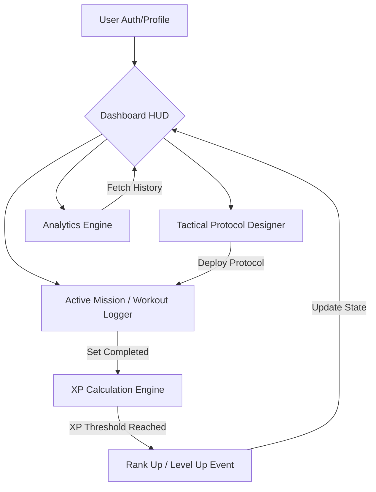

# ⚡ LEVEL UP: The Tactical Gym RPG Blueprint

[](https://react.dev/)
[](https://vitejs.dev/)
[](https://tailwindcss.com/)
[](https://www.typescriptlang.org/)
[](https://www.framer.com/motion/)

> **Status:** Production-Ready | **Architecture:** Tactical HUD / RPG Hybrid

**LEVEL UP** is not just a workout tracker; it is a high-performance **Tactical Fitness Operating System**. Designed with a "Gaming HUD" philosophy, it transforms the friction of physical training into a rewarding RPG progression loop. Built for athletes who demand precision, immersion, and data-driven growth.

---

## 🎯 Problem vs. Solution

| The Problem | The LEVEL UP Solution |
| :--- | :--- |
| **Friction & Boredom** | **Gamified Immersion**: Every set earns XP, driving a dopamine-rich progression loop. |
| **Static Routines** | **Tactical Protocol Designer**: Fully customizable splits with a searchable tactical library. |
| **Data Blindness** | **Analytics Engine**: Real-time performance visualization via high-fidelity charts. |
| **Forgetfulness** | **Creatine HUD**: Automated daily reminders integrated into the system core. |

---

## 🧠 Intelligence & Architecture

The system operates on a reactive state-driven architecture, ensuring that every tactical action (workout set) immediately updates the global HUD and progression metrics.

### System Flow Diagram



### Core Components Blueprint

| Module | Designation | Description |
| :--- | :--- | :--- |
| **Protocol Lab** | `SplitManager.tsx` | The mission control for designing custom workout splits. |
| **Tactical Designer** | `ProtocolEditor.tsx` | A "fresh page" experience for building routines from a tactical library. |
| **Mission Logger** | `WorkoutLogger.tsx` | Real-time interface for tracking sets, reps, and RPE. |
| **Neural Link** | `AppContext.tsx` | Centralized state management for XP, Ranks, and Session data. |
| **Visual HUD** | `Dashboard.tsx` | The primary command center with dynamic animations and status indicators. |

---

## 🛠️ Setup & Installation

### Prerequisites
- **Node.js** (v18.0.0 or higher)
- **npm** or **yarn**

### 1. Clone the Blueprint
```bash
git clone https://github.com/rahulcvwebsitehosting/level-up-rpg.git
cd level-up-rpg
```

### 2. Install Dependencies
```bash
npm install
```

### 3. Configure Environment
Create a `.env` file based on `.env.example`:
```env
VITE_GEMINI_API_KEY=your_api_key_here
```

### 4. Launch the System
```bash
npm run dev
```
The HUD will be accessible at `http://localhost:3000`.

---

## 🚀 Key Features

- **3D Animated Favicon**: A dynamic, rotating wireframe cube that signals "System Active" in your browser tab.
- **RPG Progression System**: 10+ Ranks (from Recruit to Legend) with custom XP scaling.
- **Tactical Library**: Searchable database of exercises with custom set/note configuration.
- **Creatine Reminder**: Daily notification system to ensure optimal supplement saturation.
- **Responsive HUD**: Desktop-first precision with mobile-first fluidity.

---

## 🤝 Connect & Collaborate

**Lead Developer:** Rahul Shyam  
*Architecting the future of gamified fitness.*

[](https://linkedin.com/in/rahulshyamcivil)
[](https://github.com/rahulcvwebsitehosting)

---

<p align="center">
  <i>Built with precision by <a href="https://github.com/rahulcvwebsitehosting">Rahul Shyam</a></i><br>
  <strong>LEVEL UP © 2026</strong>
</p>
