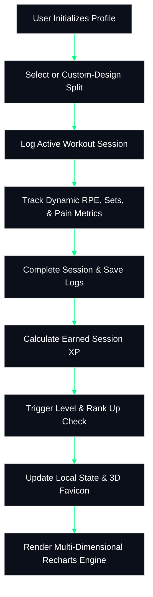
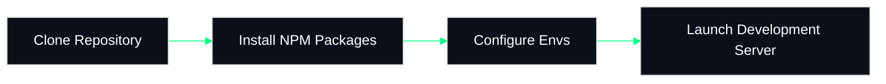
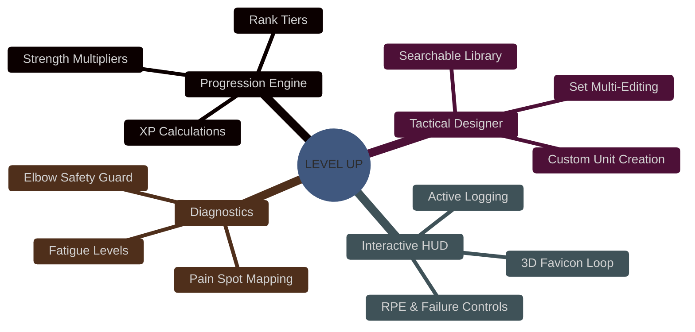
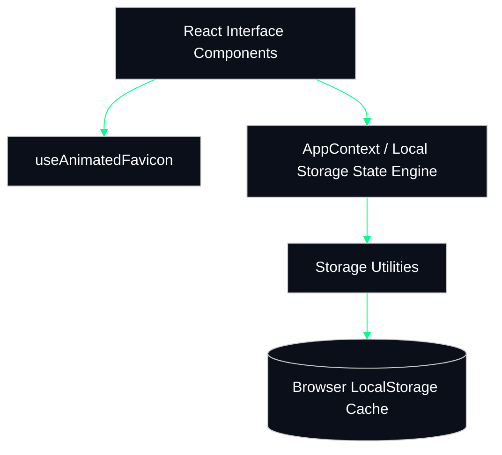

<div align="center">

# LEVEL UP

**An immersive, gamified tactical fitness operating system with RPG mechanics, real-time analytics, and split protocol tracking.**

[](https://github.com/rahulcvwebsitehosting/levelup/blob/main/LICENSE)
[](https://vitejs.dev/)
[](https://react.dev/)
[](https://tailwindcss.com/)
[](https://www.typescriptlang.org/)
[](https://web.dev/progressive-web-apps/)

**LEVEL UP transforms the physical grind of strength training into an addictive, progression-oriented RPG experience where your body is the character.**

</div>

---

## How It Works



This application uses a local **state-driven event loop** to process workout completion, tracking your volume, reps, and sets to calculate physical XP. 
The system continually evaluates your strength achievements against strict **tier-based requirements** for Bench, Squat, and Deadlift multiples relative to bodyweight. 
Every earned rank directly triggers feedback animations on your main dashboard HUD and updates the dynamic canvas rendering within the animated browser favicon.

---

## Why This?

| Feature / Metric | **LEVEL UP** | Standard Notes App | Commercial Subscriptions (Strong/Hevy) |
| :--- | :--- | :--- | :--- |
| **Gamified RPG Mechanics** | ✅ **Built-In** | ❌ No Progression | ❌ No Progression |
| **Data Privacy** | ✅ **100% Client-Side** | ⚠️ Unstructured | ❌ Server Sync Required |
| **Dynamic HUD Aesthetics** | ✅ **Cybernetic Theme** | ❌ Monospace / Text Only | ❌ Generic Corporate UI |
| **Pain & Injury Diagnostics** | ✅ **Elbow/Shoulder Tracker** | ❌ Manual Notes Only | ❌ No Contextual Warnings |
| **Zero-Subscription PWA** | ✅ **Completely Free** | ✅ Free | ❌ Hidden Behind Paywalls |

This architecture ensures that your data stays strictly in **your local custody** while providing a high-fidelity interface that rivals native premium subscription trackers.

---

## Quick Start



### 1. Verification of Prerequisites

| Tool | Version Requirement | Purpose |
| :--- | :--- | :--- |
| **Node.js** | `>= 18.x` | Runtime environment for Vite tooling |
| **npm** | `>= 9.x` | Dependency manager and execution framework |

### 2. Standard Installation Commands

To launch the interface in local development mode, execute this command sequence:

```bash
# Clone the repository
git clone https://github.com/rahulcvwebsitehosting/levelup.git
cd levelup

# Install required packages
npm install

# Run the local Vite preview environment
npm run dev
```

---

## Features



### 🏆 RPG Progression Engine
The core loop uses a **tier-based qualification** that maps accumulated physical effort directly into gamer rank achievements.
- **Rank Tiers**: Automatically progresses from **Unranked** to **Master** based on cumulative XP and multi-lift target performance.
- **Bodyweight Multipliers**: Dynamically checks your lift limits (Bench, Squat, Deadlift) relative to your customized bodyweight profile.

```typescript
// System Rank verification logic snippet
export const RANK_REQUIREMENTS = [
  { rank: 'bronze', minXP: 500, strengthRequirement: { benchMultiplier: 0.5, squatMultiplier: 0.8, deadliftMultiplier: 1.0 } },
  { rank: 'master', minXP: 20000, strengthRequirement: { benchMultiplier: 2.0, squatMultiplier: 2.5, deadliftMultiplier: 3.5 } }
];
```

### 🛠️ Tactical Protocol Designer
Design and manage highly customized routines on a dedicated, distraction-free page layout.
- **Search & Select**: Easily query standard exercise configurations from the compiled baseline list.
- **Direct Multi-Editing**: Quickly configure sets, specific tempos, and notes for all elements inside the protocol.

### 📊 Real-time Diagnostics & Tracking
Monitor systemic physiological stress dynamically while logging a workout routine.
- **Pain Tracker**: Map contextual sensitivities in key areas (e.g., lower back, elbows, shoulders).
- **Elbow-Sensitive Safeguard**: Flags target protocols containing joint-intensive move patterns (e.g., skullcrushers).

---

## System Architecture



### Repository Layout

```text
levelup/
├── public/                 # Static assets and progressive app manifests
├── src/
│   ├── components/         # View structures (Dashboard, Analytics, Editors)
│   ├── hooks/              # Custom animated Favicon processing canvas hook
│   ├── lib/                # Storage interfaces and state modifiers
│   ├── App.tsx             # Entry routing and Rank achivement notifications
│   ├── AppContext.tsx      # Core state distribution, streak counters, and event triggers
│   ├── types.ts            # Strongly-typed data contract definitions
│   └── index.css           # Global custom styled utility definitions
├── package.json            # Deployment configuration and dependencies
└── vite.config.ts          # Compilation configurations and development proxies
```

### Component Breakdown

| Component Name | Language | Core Responsibility |
| :--- | :--- | :--- |
| `Dashboard.tsx` | TypeScript (React) | Renders the primary user control deck, streaks, and current readiness score. |
| `WorkoutLogger.tsx` | TypeScript (React) | Active session interface supporting set completion, RPE, and dynamic XP metrics. |
| `ProtocolEditor.tsx` | TypeScript (React) | A standalone canvas page enabling step-by-step exercise creation and target set adjustments. |
| `Analytics.tsx` | TypeScript (React) | Implements detailed performance charts detailing weekly metrics and target splits. |
| `useAnimatedFavicon.ts`| TypeScript (React Hook) | Draws a rotating 3D wireframe cube on a hidden canvas and updates link tags dynamically. |

---

## Development Guide

### Running the App Locally

To build and run the system under development configurations, execute the following commands in order:

```bash
# Verify system packages
npm run lint

# Compile production-ready assets
npm run build

# Preview production build locally
npm run preview
```

---

## Honest Maintenance & Risk Management

### ⚠️ Local Storage Dependence
Because LEVEL UP operates **entirely client-side** to prioritize data privacy, all workout sessions, streaks, and customization profiles are saved in `localStorage`. 
Clearing your browser's site data, cache, or running automated privacy cleaners **will erase your progress**. 
Ensure you maintain your profile locally by refraining from resetting site cookies.

### 🛡️ Update Strategy
The application has **zero external server database costs**, making it exceptionally stable to host indefinitely. 
Security patches are monitored through Dependabot and integrated into standard repository checkins. 
Compatibility checks are performed against latest stable releases of Chrome, Safari, and Firefox.

---

## FAQ

#### Can I use this application completely offline?
Yes, the system operates completely on the browser's local sandbox, requiring **no internet connection** once files are loaded.

#### Is my training data uploaded to external servers?
No, LEVEL UP maintains an active **zero-telemetry policy** with all calculations processed exclusively inside your system.

#### How does the animated favicon impact browser performance?
The rotating 3D favicon relies on highly optimized `requestAnimationFrame` hooks, consuming **less than 0.5%** CPU overhead.

#### Can I connect my profile to a cloud sync database?
The architecture relies on abstract storage layers, allowing future extensions to connect **relational APIs** if desired.

#### Does the app support custom exercises outside default suggestions?
Yes, the tactical editor allows you to specify **completely custom titles**, notes, and set goals.

---

## Contributing

We welcome structural improvements, design updates, and translation contributions.

- Report a functional anomaly in the [Issue Tracker](https://github.com/rahulcvwebsitehosting/levelup/issues).
- Propose feature designs by initiating a [Pull Request](https://github.com/rahulcvwebsitehosting/levelup/pulls).

```bash
# Standard workflow for pull requests
git checkout -b feature/your-feature-name
npm run lint
git commit -m "feat: implement customized profile metrics"
```

---

## License & Attribution

This project is licensed under the terms of the **MIT License**. For full terms, inspect the [`LICENSE`](https://github.com/rahulcvwebsitehosting/levelup/blob/main/LICENSE) file in this repository.

Special attribution is extended to the upstream developer tools making this lightweight, gamified OS possible:
- **Tailwind CSS** for low-latency utility-first styles.
- **Lucide Icons** for modern tactical UI markers.
- **Framer Motion** for physics-based layout transitions.
- **Recharts** for SVG data visualization graphics.
